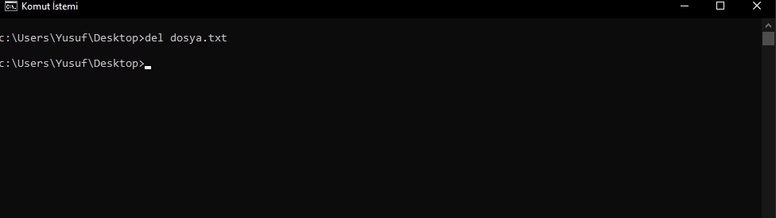
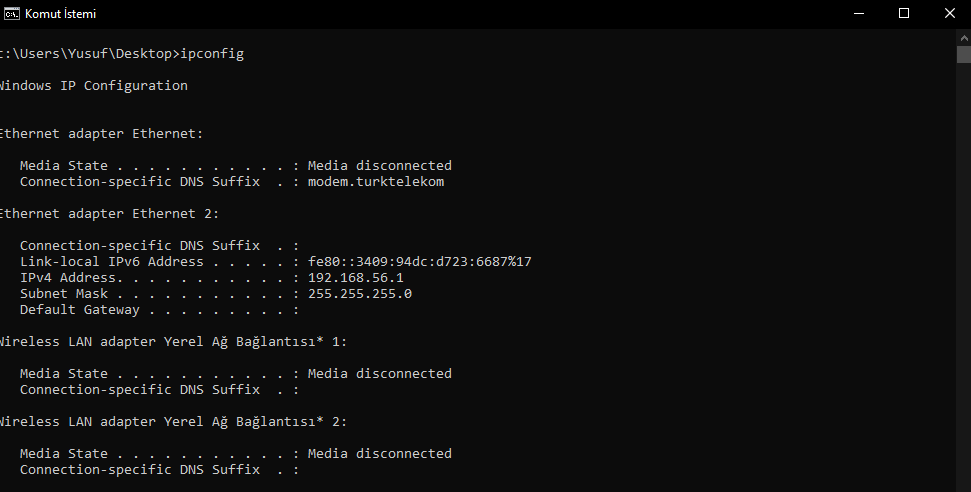
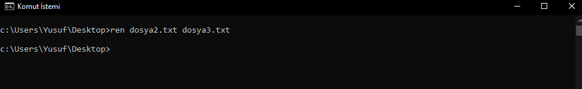
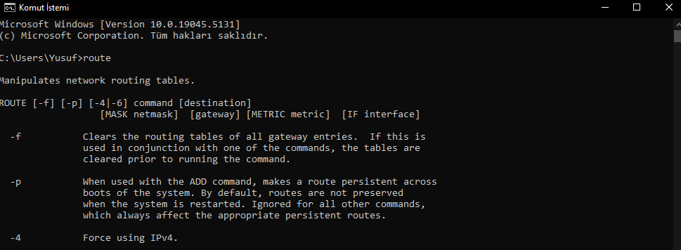

# windowskomutlari

  ## `arp` Komutu
 ARP (Address Resolution Protocol) tablosunu görüntüler veya yönetir.
 
 ```bash
 arp
 ```
 
 
  ## `attrib` Komutu
Dosya veya klasör özniteliklerini değiştirmeye yarar. 
 ```bash
 attrib
 ```
 
 
  ## `cacls` Komutu
 Dosya ve klasör izinlerini görüntüler ve değiştirir. (Windows 7 ve sonrasında yerine icacls kullanılmalıdır.)

 ```bash
 cacls
 ```
 
 
  ## `cd` Komutu
 Çalışma dizinini değiştirir.
 
 ```bash
 cd
 ```
 
 
  ## `cls` Komutu
Komut satırını temizler. 
 ```bash
 cls
 ```
 
 
  ## `color` Komutu
 Komut satırındaki yazı ve arka plan rengini değiştirir.
 
 ```bash
 color
 ```
 
 
  ## `copy` Komutu
 Dosyaları kopyalar.
 
 ```bash
 copy
 ```
 
 
  ## `date` Komutu
 Sistemin tarihini görüntüler veya değiştirir.
 
 ```bash
 date
 ```
 
 
  ## `del` Komutu
 Dosyaları siler.
 
 ```bash
 del
 ```
 
 
  ## `dir` Komutu
 Dizin içeriğini listeler.
 
 ```bash
 dir
 ```
 
 
  ## `driverquery` Komutu
 Sistem sürücülerini ve sürücü bilgilerini listeler.
 
 ```bash
 driverquery
 ```
 
 
  ## `echo` Komutu
 Komut satırında metin veya değişken değeri görüntüler.
 
 ```bash
 echo
 ```
 
 
  ## `ftp` Komutu
 FTP sunucusuna bağlanır ve dosya transferi yapar.
 
 ```bash
 ftp
 ```
 
 
  ## `getmac` Komutu
 Ağ adaptörlerinin MAC adreslerini gösterir.
 
 ```bash
 getmac
 ```
 
 
  ## `hostname` Komutu
 Bilgisayarın adını gösterir.
 
 ```bash
 hostname
 ```
 
 
  ## `ipconfig` Komutu
 Ağ yapılandırması bilgilerini gösterir.
 
 ```bash
 ipconfig
 ```
 
 
  ## `mkdir` Komutu
 Yeni bir klasör oluşturur.
 
 ```bash
 mkdir
 ```
 
 
  ## `move` Komutu
 Dosya veya klasörü taşır.
 
 ```bash
 move
 ```
 
 
  ## `net user` Komutu
 Kullanıcı hesaplarını yönetir.
 
 ```bash
 netuser
 ```
 
 
  ## `netsh` Komutu
 Ağ yapılandırmalarını yönetir.
 
 ```bash
 netsh
 ```
 
 
  ## `netstat` Komutu
 Ağ bağlantılarını ve portları gösterir.
 
 ```bash
 netstat
 ```
 
 
  ## `nslookup` Komutu
 DNS sorgulaması yapar.
 
 ```bash
 nslookup
 ```
 
 
  ## `pathping` Komutu
 Ağ yolunu analiz eder.
 
 ```bash
 pathping
 ```
 
 
  ## `ping` Komutu
 Hedef bir IP adresine veri paketleri gönderir ve bağlantıyı test eder.
 
 ```bash
 ping
 ```
 
 
  ## `powercfg list` Komutu
 Mevcut güç planlarını listeler.
 
 ```bash
 powercfglist
 ```
 
 
  ## `ren` Komutu
 Dosya veya klasör adını değiştirir.
 
 ```bash
 ren
 ```
 
 
  ## `rmdir` Komutu
 Boş klasörleri siler.
 
 ```bash
 rmdir
 ```
 
 
  ## `route` Komutu
 Yönlendirme tablosunu yönetir.
 
 ```bash
 route
 ```
 
 
  ## `schtasks` Komutu
 Zamanlanmış görevleri yönetir.
 
 ```bash
 schtasks
 ```
 
 
  ## `set` Komutu
 Çevre değişkenlerini görüntüler veya ayarlar.
 
 ```bash
 set
 ```
 
 
  ## `shutdown` Komutu
 Bilgisayarı kapatır veya yeniden başlatır.
 
 ```bash
 shutdown
 ```
 
 
  ## `systeminfo` Komutu
 Sistem hakkında bilgi verir.
 
 ```bash
 systeminfo
 ```
 
 
  ## `tasklist` Komutu
 Çalışan işlemleri listeler.
 
 ```bash
 tasklist
 ```
 
 
  ## `time` Komutu
 Sistemin saatini gösterir veya değiştirir.
 
 ```bash
 time
 ```
 
 
  ## `timeout` Komutu
 Komut satırını belirli bir süre bekletir.
 
 ```bash
 timeout
 ```
 
 
  ## `title` Komutu
 Komut istemi penceresinin başlığını değiştirir.
 
 ```bash
 title
 ```
 
 
  ## `tracert` Komutu
 Bir hedefe giden yolun izlediği adımları gösterir.
 
 ```bash
 tracert
 ```
 
 
  ## `tree` Komutu
 Dizin yapısını ağaç şeklinde görüntüler.
 
 ```bash
 tree
 ```
 
 
  ## `ver` Komutu
 Windows işletim sistemi sürümünü görüntüler.
 
 ```bash
 ver
 ```
 
 
  ## `whoami` Komutu
 Geçerli kullanıcıy
 
 ```bash
 whoami
 ```
 
 

